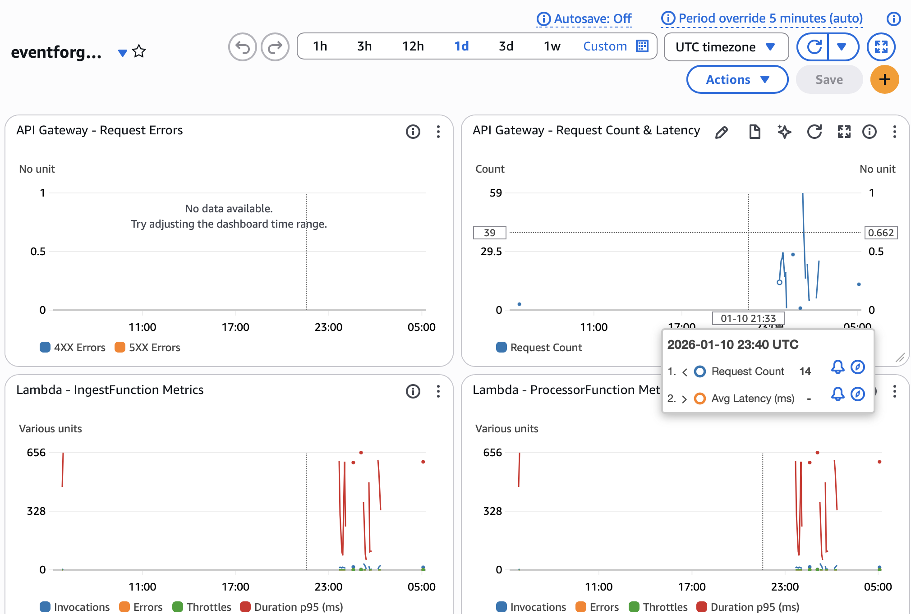
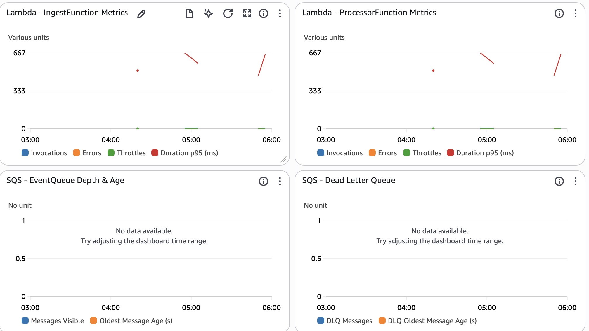

# EventForge

> A production-ready serverless event ingestion and processing platform demonstrating operational maturity, reliability patterns, and observability best practices.

## Project Overview

EventForge is a **serverless event ingestion and processing platform** built on AWS that showcases real-world distributed systems architecture. It provides a robust, scalable pipeline for receiving, queuing, processing, and persisting event data with built-in reliability guarantees and comprehensive observability.

**Key Characteristics:**
- **Fully Serverless**: Built entirely on managed AWS services (API Gateway, Lambda, SQS, DynamoDB, CloudWatch)
- **Production-Grade**: Includes monitoring dashboards, alarms, dead letter queues, and structured logging
- **Reliable by Design**: Implements idempotency, conditional writes, and retry mechanisms
- **Operationally Mature**: CloudWatch dashboards, alarms for critical metrics, and searchable JSON logs
- **Cost-Efficient**: Pay-per-use pricing model with automatic scaling

## High-Level Architecture

EventForge implements a decoupled event-driven architecture pattern commonly used in production systems:

```
┌────────┐    HTTP POST     ┌─────────────┐
│ Client │ ───────────────> │ API Gateway │
└────────┘                  └──────┬──────┘
                                   │
                                   ▼
                          ┌────────────────┐
                          │ Ingest Lambda  │ ← Validates event schema
                          └────────┬───────┘   Enriches with metadata
                                   │           Publishes to SQS
                                   ▼
                            ┌─────────┐
                            │   SQS   │ ← Decouples ingestion from processing
                            │  Queue  │   Provides buffering & retries
                            └────┬────┘
                                 │
                    ┌────────────┴────────────┐
                    │                         │
                    ▼                         ▼
          ┌──────────────────┐      ┌──────────────┐
          │ Processor Lambda │      │ Dead Letter  │
          └────────┬─────────┘      │    Queue     │
                   │                └──────────────┘
                   │                      ▲
                   ▼                      │
           ┌──────────────┐              │
           │   DynamoDB   │         (Failed after
           │ Event Store  │          3 retries)
           └──────────────┘
```

**Architecture Components:**

1. **API Gateway**: Exposes REST endpoint (`POST /events`) with CORS support and rate limiting
2. **Ingest Lambda**: Validates incoming events, enriches with metadata (timestamps, IDs), and enqueues to SQS
3. **SQS Queue**: Decouples ingestion from processing, provides message buffering and automatic retries
4. **Processor Lambda**: Consumes messages in batches, writes to DynamoDB with idempotency guarantees
5. **DynamoDB**: Stores processed events with composite key (`pk`, `sk`) for efficient querying
6. **Dead Letter Queue (DLQ)**: Captures failed messages after max retries for investigation and replay
7. **CloudWatch**: Centralized logging, metrics dashboards, and production alarms

## Reliability & Idempotency

EventForge implements **at-least-once delivery** with **exactly-once persistence** guarantees through:

### Client-Supplied Event IDs
- Clients can provide an `id` field in the event payload for natural deduplication
- If not provided, the system generates a UUID automatically
- Example: `{"id": "order-123", "type": "order-placed", "data": {...}}`

### Conditional Writes to DynamoDB
The processor uses DynamoDB's conditional writes to prevent duplicate event storage:

```typescript
// DynamoDB Item Schema
{
  pk: "EVENT#<id>",           // Partition key
  sk: "v0",                    // Sort key (constant version)
  timestamp: "2026-01-10T...", // ISO timestamp
  type: "order-placed",
  data: {...},
  requestId: "req-uuid",
  raw: "<original-sqs-body>"
}

// Conditional Write
ConditionExpression: 'attribute_not_exists(pk) AND attribute_not_exists(sk)'
```

**Behavior:**
- ✅ First write succeeds → Event stored
- ⚠️ Duplicate detected → ConditionalCheckFailedException caught, logged as warning, no error thrown
- ✅ SQS message deleted successfully in both cases

### Retry & Failure Handling
- **SQS Retries**: Up to 3 retry attempts with exponential backoff
- **Dead Letter Queue**: Failed messages moved to DLQ after max retries
- **Partial Batch Failures**: Individual message failures don't reprocess entire batch

**Result**: Sending the same event ID multiple times results in exactly one DynamoDB record, even with SQS retries.

## Observability & Monitoring

EventForge includes production-grade observability across all layers of the stack.

### CloudWatch Dashboard

Real-time operational dashboard monitoring the entire pipeline:





**Dashboard Widgets:**
- **API Gateway**: Request count, 4XX/5XX errors, latency (avg)
- **Lambda Functions**: Invocations, errors, throttles, duration (p95)
- **SQS Queues**: Message depth, oldest message age (EventQueue + DLQ)

Access: `CloudWatch → Dashboards → <stack-name>-monitoring`

### CloudWatch Alarms

Four production-ready alarms for critical failure scenarios:

| Alarm | Metric | Threshold | Action Required |
|-------|--------|-----------|-----------------|
| **DLQ Messages** | `ApproximateNumberOfMessagesVisible` | ≥ 1 message | Investigate DLQ for failed events; check processor logs |
| **Queue Age** | `ApproximateAgeOfOldestMessage` | ≥ 60 seconds (2 min) | Check Lambda concurrency limits; verify DynamoDB capacity |
| **Processor Errors** | Lambda `Errors` | ≥ 1 error | Review structured logs for failure root cause |
| **API 5XX Errors** | API Gateway `5XXError` | ≥ 1 error | Check IngestFunction health; verify SQS availability |

All alarms configured with `TreatMissingData: notBreaching` to avoid false positives during low traffic.

### Structured Logging

All Lambda functions emit **single-line JSON logs** for easy parsing and searching:

```json
{
  "level": "INFO",
  "service": "processor",
  "message": "Successfully processed event",
  "eventId": "order-123",
  "requestId": "req-uuid",
  "sqsMessageId": "msg-uuid",
  "timestamp": "2026-01-10T12:34:56.789Z",
  "meta": {"pk": "EVENT#order-123", "sk": "v0"}
}
```

**CloudWatch Insights Query Example:**
```sql
fields @timestamp, level, service, message, eventId, requestId
| filter level = "ERROR"
| sort @timestamp desc
| limit 100
```

**Tail Logs in Real-Time:**
```bash
sam logs -n IngestFunction --stack-name eventforge-dev --tail
sam logs -n ProcessorFunction --stack-name eventforge-dev --tail
```

## Why This Project Matters

EventForge demonstrates skills and patterns relevant to senior backend and platform engineering roles:

### 1. **Real Production Architecture**
This mirrors event ingestion systems used at scale in production environments (e.g., analytics platforms, audit logging, event sourcing). The decoupled architecture allows independent scaling of ingestion and processing layers.

### 2. **Operational Maturity**
Beyond "make it work," this project shows:
- **Observability**: Dashboards, alarms, structured logging
- **Reliability**: Idempotency, retries, DLQs, conditional writes
- **Cost Efficiency**: Serverless with pay-per-use pricing

### 3. **Distributed Systems Patterns**
Implements concepts critical to distributed systems:
- Idempotency keys and deduplication
- At-least-once delivery with exactly-once semantics
- Backpressure handling via SQS buffering
- Failure isolation with dead letter queues

### 4. **Infrastructure as Code**
Entire stack defined in `infra/template.yaml` using AWS SAM, enabling:
- Reproducible deployments across environments (dev, staging, prod)
- Version-controlled infrastructure changes
- Multi-stack deployments without resource collisions

### 5. **Relevant to Backend & Platform Roles**
Skills demonstrated:
- Event-driven architectures
- AWS serverless services (Lambda, API Gateway, SQS, DynamoDB)
- Production observability practices
- TypeScript for Lambda functions
- Infrastructure as Code (AWS SAM / CloudFormation)

## Tech Stack

- **Runtime**: Node.js 20 with TypeScript
- **Infrastructure as Code**: AWS SAM (Serverless Application Model)
- **API Layer**: Amazon API Gateway (REST API)
- **Compute**: AWS Lambda (Node.js 20, ARM64)
- **Messaging**: Amazon SQS + Dead Letter Queue
- **Database**: Amazon DynamoDB (on-demand billing)
- **Observability**: Amazon CloudWatch (Dashboards, Alarms, Logs)
- **Development**: esbuild (bundling), AWS SDK v2

## Idempotency Proof

EventForge guarantees that sending the same event `id` multiple times results in exactly one DynamoDB record. The processor Lambda uses conditional writes (`attribute_not_exists(pk) AND attribute_not_exists(sk)`) to prevent duplicate entries.

**Example Test:**

Send the same event twice with `id: "idem-test-001"`:

```bash
# First request
curl -X POST "https://<your-api-id>.execute-api.<region>.amazonaws.com/Prod/events" \
  -H "Content-Type: application/json" \
  -d '{"id":"idem-test-001","type":"idempotency-test","data":{"try":1}}'

# Second request (same id)
curl -X POST "https://<your-api-id>.execute-api.<region>.amazonaws.com/Prod/events" \
  -H "Content-Type: application/json" \
  -d '{"id":"idem-test-001","type":"idempotency-test","data":{"try":2}}'
```

**Verify only one record exists:**

```bash
aws dynamodb query \
  --table-name "eventforge-event-store" \
  --key-condition-expression "pk = :pk" \
  --expression-attribute-values '{":pk":{"S":"EVENT#idem-test-001"}}' \
  --query "Count" --output text
```

Expected output: `1` (only one record, even though we sent the event twice)

The processor logs duplicate attempts as warnings without throwing errors, ensuring graceful handling of retries.

## API Endpoints

### POST /events - Ingest Event

Accepts an event payload and enqueues it for processing.

**Request:**
```bash
curl -X POST "https://<api-id>.execute-api.<region>.amazonaws.com/Prod/events" \
  -H "Content-Type: application/json" \
  -d '{
    "id": "optional-custom-id",
    "type": "user.signup",
    "data": {"userId": 123, "email": "user@example.com"}
  }'
```

**Response (202 Accepted):**
```json
{
  "accepted": true,
  "event": {
    "id": "optional-custom-id",
    "type": "user.signup",
    "timestamp": "2026-01-10T12:34:56.789Z"
  },
  "messageId": "abc123-sqs-message-id"
}
```

### GET /events/recent - Query Recent Events

Retrieves recently processed events from DynamoDB (newest first).

**Request:**
```bash
# Get latest 25 events (default)
curl "https://<api-id>.execute-api.<region>.amazonaws.com/Prod/events/recent"

# Get latest 50 events
curl "https://<api-id>.execute-api.<region>.amazonaws.com/Prod/events/recent?limit=50"

# Filter by event type
curl "https://<api-id>.execute-api.<region>.amazonaws.com/Prod/events/recent?type=user.signup&limit=10"
```

**Response (200 OK):**
```json
{
  "items": [
    {
      "id": "event-123",
      "type": "user.signup",
      "timestamp": "2026-01-10T12:34:56.789Z",
      "data": {"userId": 123},
      "requestId": "req-abc"
    }
  ],
  "count": 25,
  "nextToken": "optional-pagination-token"
}
```

**Query Parameters:**
- `limit` (optional): Number of events to return (default 25, max 100)
- `type` (optional): Filter events by type (e.g., `user.signup`)

**Implementation Details:**
- Uses DynamoDB Global Secondary Index (GSI1) with `gsi1pk='RECENT'` and `gsi1sk=timestamp`
- Returns newest events first (`ScanIndexForward: false`)
- Type filtering uses DynamoDB `FilterExpression` (applied after query, counts toward limit)

**Design Tradeoffs:**
- ✅ **Pro**: Simple query pattern, efficient for recent events use case
- ⚠️ **Con**: Type filter is inefficient (scans all results, then filters). For production workloads with many event types, consider a dedicated GSI per type or ElasticSearch/OpenSearch for complex querying.
- ⚠️ **Con**: GSI costs additional storage (duplicates all attributes). For cost optimization, use `ProjectionType: KEYS_ONLY` if only IDs are needed.

## EventForge Console

A production-quality React + TypeScript operator console is available at [apps/console](apps/console/).

The console provides:
- **Event Composer**: Send test events with full control (custom IDs for idempotency)
- **Recent Events Browser**: View, search, and filter your event history
- **System Health**: Real-time API monitoring and diagnostics
- **Operations Dashboard**: Quick access to CloudWatch, SQS, and DynamoDB resources
- **Responsive UI**: Modern, mobile-friendly interface built with React, TypeScript, Tailwind CSS, and TanStack Query

See [apps/console/README.md](apps/console/README.md) for setup and usage instructions.

## Deployment

### Prerequisites

- **Node.js 20+** and npm
- **AWS CLI** configured with credentials
- **AWS SAM CLI** installed ([installation guide](https://docs.aws.amazon.com/serverless-application-model/latest/developerguide/install-sam-cli.html))

### Build and Deploy

```bash
# 1. Build Lambda functions
cd services/ingest-api && npm install && npm run build
cd ../processor && npm install && npm run build

# 2. Build SAM application
cd ../../infra
sam build --template-file template.yaml

# 3. Deploy (first time - interactive)
sam deploy --guided

# 4. Deploy (subsequent deployments)
sam deploy
```

**Deployment Outputs:**
- `ApiUrl`: API Gateway endpoint for sending events
- `DashboardUrl`: CloudWatch dashboard URL
- `QueueUrl`: SQS queue URL
- `EventTableName`: DynamoDB table name
- Alarm names for all CloudWatch alarms

### Verify Deployment

```bash
# Get API endpoint
API_URL=$(aws cloudformation describe-stacks \
  --stack-name eventforge-dev \
  --query "Stacks[0].Outputs[?OutputKey=='ApiUrl'].OutputValue" \
  --output text)

# Send test event
curl -X POST "$API_URL" \
  -H "Content-Type: application/json" \
  -d '{"type":"test-event","data":{"message":"Hello EventForge"}}'

# Check CloudWatch dashboard
# Navigate to CloudWatch → Dashboards → eventforge-dev-monitoring
```

## Local Development

### Build Services

```bash
# IngestFunction
cd services/ingest-api
npm install
npm run build  # Output: dist/handler.js

# ProcessorFunction
cd ../processor
npm install
npm run build  # Output: dist/handler.js
```

### Run Tests

```bash
# IngestFunction tests
cd services/ingest-api
npm test

# ProcessorFunction tests
cd ../processor
npm test
```

### View Logs

```bash
# Tail logs in real-time
sam logs -n IngestFunction --stack-name eventforge-dev --tail
sam logs -n ProcessorFunction --stack-name eventforge-dev --tail

# Query specific time range
sam logs -n ProcessorFunction --stack-name eventforge-dev \
  --start-time '10min ago' --end-time 'now'
```

## Project Structure

```
eventforge/
├── apps/
│   └── console/             # React + TypeScript operator console
│       ├── src/
│       │   ├── components/  # UI components (Layout, Cards, Buttons, etc.)
│       │   ├── hooks/       # TanStack Query hooks
│       │   ├── lib/         # API client and utilities
│       │   ├── pages/       # React Router pages (Overview, Events, Ops, Settings)
│       │   └── types/       # TypeScript type definitions
│       ├── package.json
│       └── vite.config.ts
├── services/
│   ├── ingest-api/          # Event ingestion Lambda
│   │   ├── src/
│   │   │   └── handler.ts   # API Gateway handler with validation
│   │   ├── package.json
│   │   └── tsconfig.json
│   └── processor/           # Event processor Lambda
│       ├── src/
│       │   └── handler.ts   # SQS consumer with DynamoDB writes
│       ├── package.json
│       └── tsconfig.json
├── infra/
│   ├── template.yaml        # SAM/CloudFormation template
│   └── samconfig.toml       # SAM deployment configuration
├── docs/
│   ├── architecture.md      # Detailed architecture documentation
│   ├── roadmap.md          # Project roadmap and phases
│   └── screenshots/        # Dashboard and monitoring screenshots
└── README.md               # This file
```

## Additional Documentation

- [Architecture Deep Dive](docs/architecture.md) - Detailed component descriptions and reliability patterns
- [Project Roadmap](docs/roadmap.md) - Implementation phases and future enhancements

## License

MIT
